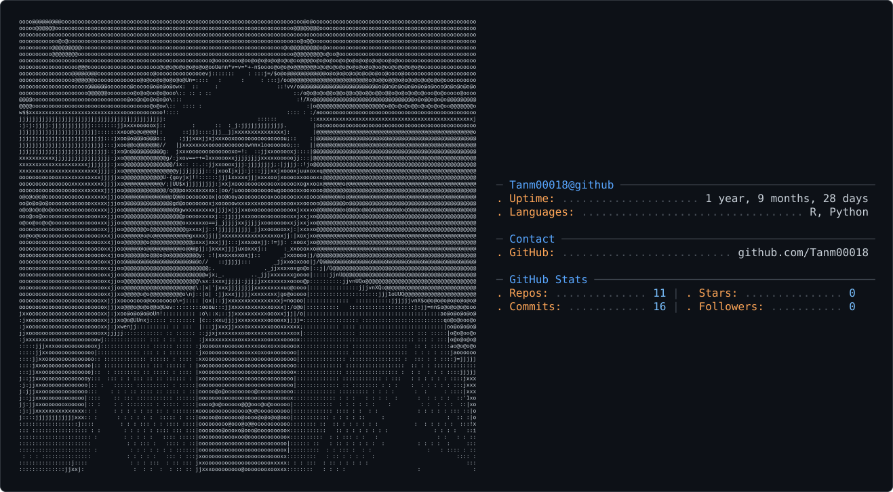

<picture>
  <source media="(prefers-color-scheme: dark)" srcset="dark_mode.svg" />
  <source media="(prefers-color-scheme: light)" srcset="light_mode.svg" />
  
</picture>

# 👋 About Me

I'm an engineering student focused on **Artificial Intelligence, Computer Vision, Deep Learning, and Generative AI**.

I enjoy building things with Python, breaking them, fixing them, and understanding what's happening under the hood rather than simply making things work.

Currently experimenting with **real-time computer vision, image enhancement, deep learning, and generative AI**, while turning random "what if?" ideas into working systems.

> Always learning. Always experimenting. Probably debugging something right now.

---

# 🚀 Currently Building

### 🌫️ Real-Time Fog & Night-Vision Enhancement

An AI-powered computer vision system focused on improving visibility in **foggy and low-light environments**.

The project explores image enhancement and deep learning techniques with an emphasis on building something that can work in real-time rather than remaining purely experimental.

**Exploring:**

`Computer Vision` · `Deep Learning` · `Image Enhancement` · `Low-Light Vision` · `Real-Time Inference`

---

# 🧠 Tech Stack

### 💻 Languages


### 🤖 AI / Machine Learning


### 📊 Data & Visualization


### 🌐 Development


### ☁️ Cloud, Database & DevOps


### 🛠️ Tools


---

# 🔬 Featured Projects

### 🌫️ Real-Time Fog & Night-Vision Enhancement

An AI-powered computer vision project aimed at improving visibility in adverse visual conditions such as **fog and low-light environments**.

**Focus:** Computer Vision · Deep Learning · Image Enhancement · Real-Time Processing

---

### 🧬 Generative AI / GAN Experiments

Hands-on experimentation with **Generative Adversarial Networks and generative deep learning**, exploring how models can learn to create and transform visual data.

**Focus:** GANs · Deep Learning · Generative AI · Computer Vision

---

### 🧪 AI Experiments

A collection of smaller experiments and prototypes exploring different ideas across machine learning, computer vision, and application development.

> Some ideas start as "what if?" and end up as something that actually works.

---

# 📊 GitHub Activity

<p align="center">
  
  
</p>

<p align="center">
  
</p>

---

# 🎯 Areas of Interest

```text
Artificial Intelligence
Computer Vision
Deep Learning
Generative AI
Image & Video Processing
Real-Time AI Systems
AI-powered Applications
```

---

# ⚡ Engineering Mindset

```text
Understand → Build → Break → Debug → Improve → Repeat
```

I like going beyond the surface level — understanding algorithms, experimenting with different approaches, and figuring out why something works (or doesn't).

---

<p align="center">
  
</p>

